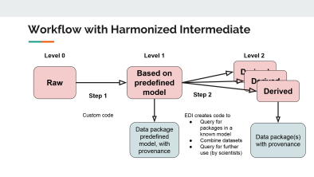
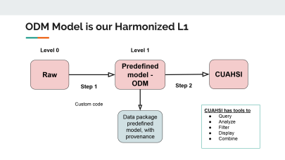

# Background
## ClimHydroDB
ClimDB/HydroDB (built in late 90's) is a centralized server to provide open access to long-term meteorological and streamflow records from a collection of research sites. Its software is aging and will soon be unmaintainable. Further, data are somewhat limited in terms of parameters and time resolution, and other more sophisticated systems have been developed since which may match our needs. 

EDI, LTER and USFS jointly organized an workshop to review current practices and develop a strategy for the next steps.
https://environmentaldatainitiative.org/dataset-design/met-hydro-data-package-design/

## Participants:
list here.

## Data harmonization
EDI has developed a [data harmonization framework](https://environmentaldatainitiative.org/dataset-design/), 
in which primary data are reformatted to a common intermediate for reuse. 
It is currently being successfully applied to designing data packages for [community survey data: ecocomDP](https://github.com/EDIorg/ecocomDP). Figure 1 shows a schematic of the concept. Archived raw data (level 0 - L0) are converted to a common harmonized data model (level 1 - L1). The L1 data allow for a straightforward data discovery and conversion into derived data products (level 2 - L2) in support of synthesis studies and other uses. 

 

## Data models for met and hydrologic data
A number of data models are commonly used in the research community for harmonizing meteorological and hydrological data. The most prominent of these is the ODM data model for time series, developed and used by the [Consortium of Universities for the Advancement of Hydrologic Science (CUHASI)](https://cuahsi.org). The CUAHSI data platform provides tools for visualization, analysis and might provide some of the ClimDB/HydroDB plotting functionality.  Hence, the ODM model of the CUAHSI HIS is a good candidate for the L1 data model.

At the workshop, a first draft of a workflow was designed for converting all ClimDB/HydroDB products (L0) as well as meteorological and hydrological data in the EDI repository (raw L0) archive those in the EDI data repository as L1 data packages. If the ODM data model is adopted, the data packages will also be available in CUAHSI, hopefully with comparable functionality to ClimDB/HydroDB (see figure 2 for the conceptual workflow).

 

### Other expertise available to this group:
Wade Sheldon's GCE Data Toolbox can be applied for the conversion of L0 data packages to the L1 data model. Margaret O'Brien is involved is several semantics projects which might benefit this project as well (although data must adhere to the CUAHSI ODM vocabulary). Vocabularies are also important for defining suitable keywords at the data package level and thereby enhance data discoverability in the EDI repository and via Google's data search.

